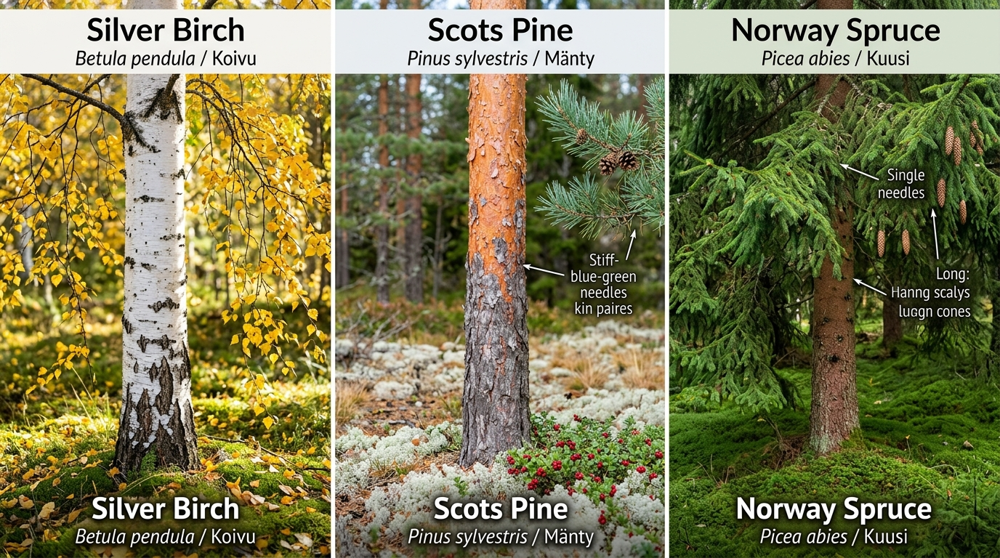

# 03. Seasonal Calendar & Forest Ecology of Uusimaa

To find mushrooms consistently around Helsinki, you must understand two biological fundamentals: **Finnish Forest Habitat Types** (the host trees and soil conditions) and **Phenology** (the seasonal timing dictated by temperature, day length, and rainfall).

---

## 1. Forest Ecology & Cajander's Forest Site Types

Finnish foresters and botanists classify forests using the **Cajander site type classification**, based on understory ground vegetation. Each site type fosters specific mycorrhizal (root-symbiotic) fungi:

```
[ Rich Deciduous Grove ]  -->  [ Mesic Spruce Heath ]  -->  [ Dry Pine Heath ]  -->  [ Peatland Bog ]
       (Lehto)                    (Tuore kangas)              (Kuiva kangas)             (Räme / Korpi)
  Hazel, Oak, Birch              Norway Spruce, Moss          Scots Pine, Lichen       Sphagnum, Alder
  Black Trumpets, Ceps           Chanterelles, Porcini        Pine Boletes, Cow Fungi  Bog Russulas, Birch Boletes
```

### A. *Lehto* (Herb-rich Deciduous Groves)
- **Soil & Light**: Nutrient-dense, damp, rich humus, alkaline to neutral pH. Filtered sunlight beneath broadleaved canopies.
- **Canopy & Undergrowth**: Silver birch (*Betula pendula*), European hazel (*Corylus avellana*), aspen (*Populus tremula*), pedunculate oak (*Quercus robur*), wood anemone (*valkovuokko*), spring pea.
- **Where to find around Helsinki**: Keskuspuisto (Maunula hazelnut groves), Petikko (Vantaa), Tammisto nature reserve borders.
- **Signature Mushrooms**:
  - **Black Trumpet** (*Craterellus cornucopioides* / *mustatorvisieni*): Loves mossy banks under hazel and oak.
  - **Summer Cep** (*Boletus reticulatus* / *tammenherkkutatti*).
  - **Charcoal Burner** (*Russula cyanoxantha* / *kyyhkyshapero*).

### B. *Tuore kangas* (Mesic Spruce-Blueberry Heath - *Myrtillus* type)
- **Soil & Light**: Acidic podzol, thick moisture-retentive carpet of red-stemmed feather moss (*Pleurozium schreberi*) and stair-step moss (*Hylocomium splendens*).
- **Canopy & Undergrowth**: Norway spruce (*Picea abies*), mixed with scattered birch. Dominated by European blueberry / bilberry (*Vaccinium myrtillus* / *mustikka*).
- **Where to find**: Sipoonkorpi, Nuuksio ravines, Luukki, Pitkäkoski.
- **The Capital Region's Mushroom Motherlode**:
  - **King Bolete / Porcini** (*Boletus edulis* / *herkkutatti*): At the base of mature spruce where blueberry gives way to moss cushions.
  - **Funnel Chanterelle** (*Craterellus tubaeformis* / *suppilovahvero*): Shaded north-facing slopes, nestled deep inside thick green moss.
  - **Wood Hedgehog** (*Hydnum repandum* / *vaaleaorakas*): Forming rings (*fairy rings*) in mossy spruce troughs.
  - **Gypsy Mushroom** (*Cortinarius caperatus* / *kehnäsieni*): Among blueberry bushes.
  - **DEADLY WARNING**: This exact habitat is also where the lethal **Destroying Angel** (*Amanita virosa*) and **Deadly Webcap** (*Cortinarius rubellus*) grow!

### C. *Kuiva kangas* (Sub-xeric Pine-Lingonberry Heath - *Vaccinium* type)
- **Soil & Light**: Coarse sand, gravelly glacial moraine, rapid drainage, bright open canopy.
- **Canopy & Undergrowth**: Scots pine (*Pinus sylvestris*), lingonberry (*Vaccinium vitis-idaea* / *puolukka*), heather (*Calluna vulgaris*), and silvery reindeer lichens (*Cladonia* / *jäkälä*).
- **Where to find**: Uutela coastal ridges, Salmen ulkoilualue, rocky ridges of Nuuksio.
- **Signature Mushrooms**:
  - **Pine Bolete** (*Boletus pinophilus* / *männynherkkutatti*): Heavy mahogany-capped bolete with deep reddish reticulation.
  - **Rufous Milkcap** (*Lactarius rufus* / *kangasrousku*): Conical terracotta cap; quintessential Finnish salting mushroom.
  - **Slippery Jack & Velvet Bolete** (*Suillus luteus* / *voitatti*, *Suillus variegatus* / *kangastatti*).
  - **Copper Brittlegill** (*Russula decolorans* / *kangashapero*).

### D. *Korpi* & *Räme* (Spruce Mires & Peatland Bogs)
- **Soil & Light**: Waterlogged peat, perpetual dampness, spongy *Sphagnum* moss pillows.
- **Canopy & Undergrowth**: Stunted Scots pine, downy birch (*Betula pubescens*), bog bilberry (*juolukka*), Labrador tea (*suopursu*).
- **Where to find**: Sipoonkorpi bog edges, Nuuksio peat valleys.
- **Signature Mushrooms**:
  - **Orange Birch Bolete** (*Leccinum versipelle* / *koivunpunikkitatti*).
  - **Marsh Brittlegill** (*Russula paludosa* / *isohapero*): Giant blood-red cap with mild apple-sweet crunch.
  - **Northern Milkcap** (*Lactarius trivialis* / *haaparousku*).

---

## 2. Month-by-Month Foraging Calendar in Southern Finland

```
May        Jun        Jul        Aug        Sep        Oct        Nov
 |----------|----------|----------|----------|----------|----------|
 [Korvasieni]
            [Kantarelli starts]
                       [Tatit / Porcini explosion]
                                  [Peak Diversity: All Species]
                                             [Suppilovahvero / Late Autumn]
```

### May – Early June: The Spring Anomaly
- **Target**: **False Morel** (*Gyromitra esculenta* / *korvasieni*).
- **Habitat**: Disturbed sandy pine soil, clearcuts, logging tire ruts.
- **Crucial Caution**: *Gyromitra esculenta* contains **gyromitrin**, a lethal volatile toxin that metabolizes into monomethylhydrazine (rocket propellant). In Finland, it is traditionally parboiled twice with vigorous ventilation. **Not recommended for novices.**

### July: The Midsummer Awakening
- **Weather Factor**: Needs warm summer rains. If July is dry, fungi stay dormant.
- **Targets**:
  - **Golden Chanterelle** (*Cantharellus cibarius*): Starts fruiting along exposed forest trails, mossy bedrock crevices, and ditch banks.
  - Early boletes (*Leccinum*, *Suillus*).
- **Forager Tip**: Inspect south-facing hillsides where sunlight warmed the forest floor first.

### August: The Grand Flush (The Boletes & Russulas)
- **Prime Conditions**: Warm nights (>12°C) combined with heavy late-summer thunderstorms.
- **Targets**:
  - **King Bolete / Porcini** (*Boletus edulis*): Massive flush lasting 2–3 weeks. Must be harvested early before fungus gnats lay eggs in the spongy pores.
  - **Brittlegills (*Haperot*)**: Yellow brittlegill (*keltahapero*), copper brittlegill (*kangashapero*).
  - **Saffron Milkcap** (*Lactarius deliciosus* / *männynleppärousku*): Orange-milked delicacy under young pines.

### September: The Golden Peak of Mycology
- **The undisputed crown month of Finnish foraging**: Over 50 edible species fruit concurrently.
- **Targets**:
  - **Hedgehog Mushroom** (*Hydnum repandum*): Spines under the cap; firm, bug-free white meat.
  - **Black Trumpet** (*Craterellus cornucopioides*): The "black truffle of the north".
  - **Salting Milkcaps**: Woolly milkcap (*karvarousku*), Northern milkcap (*haaparousku*), Rufous milkcap (*kangasrousku*).
  - **Gypsy Mushroom** (*Cortinarius caperatus* / *kehnäsieni*).
  - **Sheep Polypore** (*Albatrellus ovinus* / *lampaankääpä*).

### October – Mid-November: The Late Frost-Resistant Season
- **Weather**: Night frosts begin (0°C to -4°C), deciduous leaves drop, forest quietens.
- **The Star**: **Funnel Chanterelle** (*Craterellus tubaeformis* / *suppilovahvero*).
  - Thrives in cold temperatures and survives light frosts.
  - Can be harvested frozen solid on the stem; once thawed gently at home, it retains prime culinary quality.
  - Season extends until permanent snow cover blankets the moss (often well into November or early December in Helsinki).

---

## 3. Forager's Field Tip: The Chanterelle Dilemma & Host Tree Identification

> [!TIP]
> **"Why am I finding heaps of Funnel Chanterelles (*Suppilovahvero*), but no Golden Chanterelles (*Kantarelli*)?"**
> **"Is it because Golden Chanterelles are easy to spot and picked early in the day?"**

This is one of the most common dilemmas for autumn foragers in Finland. While foraging pressure is real, the clock on the wall (morning vs. afternoon) is rarely the culprit. Mushrooms grow slowly over several days to weeks. The real answers lie in **seasonality**, **micro-habitat divergence**, and **tree symbiosis**.

### A. The Three Decisive Factors
1. **Calendar Phase (Late Peak vs. Residual Tail)**:
   - **Funnel Chanterelles** (*Craterellus tubaeformis*) are at their **absolute peak in mid-September to November**. They require cool, damp autumn conditions to fruit in massive numbers.
   - **Golden Chanterelles** (*Cantharellus cibarius*) peak in **July and August**. By mid-September, their primary fruiting flush is winding down. While they can produce into October if mild, yields are sporadic.
2. **The "Room" in the Forest (Spruce Bog vs. Birch/Pine Rim)**:
   - If you are surrounded by funnel chanterelles, you are standing in a **dark, damp, mature Norway spruce forest (*kuusikko*)** carpeted in deep feathermoss (*Hylocomium*, *Pleurozium*). This is prime funnel chanterelle habitat, but it is generally too dark and waterlogged for golden chanterelles.
   - Golden chanterelles demand **light, warmth, and different mycorrhizal partners**—primarily **birch (*koivu*)** and **pine (*mänty*)**.
3. **Visibility & Weekly (Not Daily) Pressure**:
   - Golden chanterelles are brilliant egg-yolk yellow. Casual walkers spot them instantly from afar, so well-trodden paths near parking lots get harvested completely every weekend.
   - Funnel chanterelles have camouflage-brown caps that blend seamlessly into fallen autumn leaves. People walk right past hundreds without noticing them.

---

### B. Tree Identification: Silver Birch vs. Scots Pine vs. Norway Spruce

Recognizing your forest canopy is the single greatest skill for locating specific mushrooms. In Finland, the "Big Three" trees dictate virtually all mushroom distribution: **Golden chanterelles** partner with birch and pine; **Pine boletes** partner with pine; while **Funnel chanterelles** and hedgehogs carpet the moss under spruce.


*(c) Botanical field guide - Left: Silver Birch (Betula pendula / Koivu) • Center: Scots Pine (Pinus sylvestris / Mänty) • Right: Norway Spruce (Picea abies / Kuusi)*

| Diagnostic Feature | Silver Birch (*Betula pendula* / *Rauduskoivu*) | Scots Pine (*Pinus sylvestris* / *Mänty*) | Norway Spruce (*Picea abies* / *Kuusi*) |
| :--- | :--- | :--- | :--- |
| **Bark Texture** | **Pure chalk-white papery bark** with dark horizontal lenticels; develops deep, rough black diamond-shaped fissures at trunk base. | **Distinctive two-toned trunk**: warm reddish-orange / cinnamon flaky bark on the upper two-thirds; thick, dark grey-brown scaly plates at the base. | Rough, scaly, uniform reddish-brown to grey-brown bark throughout the trunk. |
| **Foliage / Needles** | Broadleaf: triangular/diamond-shaped serrated leaves that turn radiant golden-yellow in autumn. | Conifer: stiff, blue-green needles growing **in pairs (clusters of two)**, 4–7 cm long. Woody rounded cones. | Conifer: short, sharp, stiff 4-angled needles growing **singly around twigs**. Long hanging cylindrical cones. |
| **Canopy & Light** | Open, weeping, light-dappled canopy. Allows abundant warmth and sunlight to reach the ground. | High, airy, sparse crown. Forest floor remains bright and dry. | Dense, conical, heavily shaded pyramid crown. Forest floor is dark and humid. |
| **Forest Floor** | Grassy hummocks, light moss, fallen golden leaves, rocky soil (*lehto* / *tuore kangas*). | Dry sandy/gravelly moraine, silvery reindeer lichens (*jäkälä*), lingonberry (*puolukka*), heather (*kuiva kangas*). | Deep, continuous sponge carpet of green feathermoss (*Hylocomium*), bilberry (*mustikka*). |
| **Associated Mushrooms** | **Golden Chanterelle**, King Bolete, Orange Birch Bolete (*punikkitatti*), Brown Birch Scaber Stalk. | **Pine Bolete** (*männynherkkutatti*), Saffron Milkcap (*leppärousku*), Rufous Milkcap (*kangasrousku*), Velvet Bolete. | **Funnel Chanterelle** (*suppilovahvero*), Wood Hedgehog (*orakas*), King Bolete, Deadly Webcap (*myrkkyseitikki*). |

---

### C. Late-Season Tactics to Find Golden Chanterelles in September
If you want golden chanterelles right now, shift your strategy:
1. **Leave the Dark Spruce Woods**: Walk out of the deep spruce hollows toward **birch groves**, forest margins, and open south- or west-facing slopes where autumn sunshine still warms the soil.
2. **Follow Dirt Paths & Rock Rims**: Check the compressed edges of tractor tracks, footpath verges, and the borders where **mossy granite rock outcrops (*kallio*)** meet young birch and pine trees.
3. **Look for Moss Hummocks**: In late autumn, golden chanterelles often fruit semi-submerged under moss and birch leaves. Look for slight rounded humps in the moss—gently lift them with your fingers to discover fat, pale yellow buttons underneath.
4. **Mark the Spot**: Chanterelle mycelium is perennial and stable. Unlike boletes, a chanterelle patch will produce in the exact same spot year after year for decades. Save the GPS pin!
