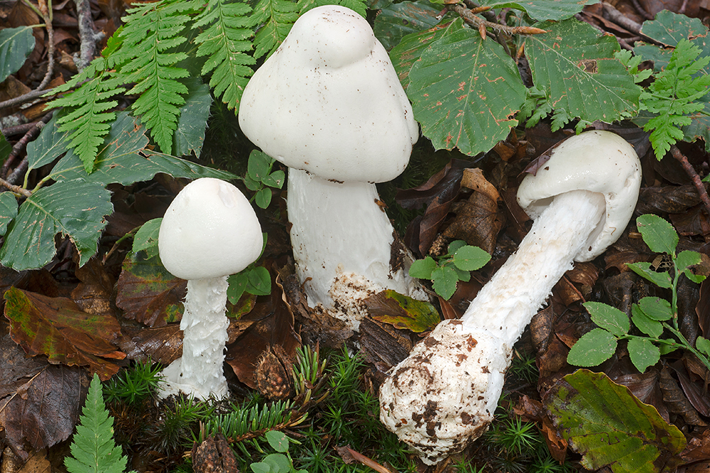
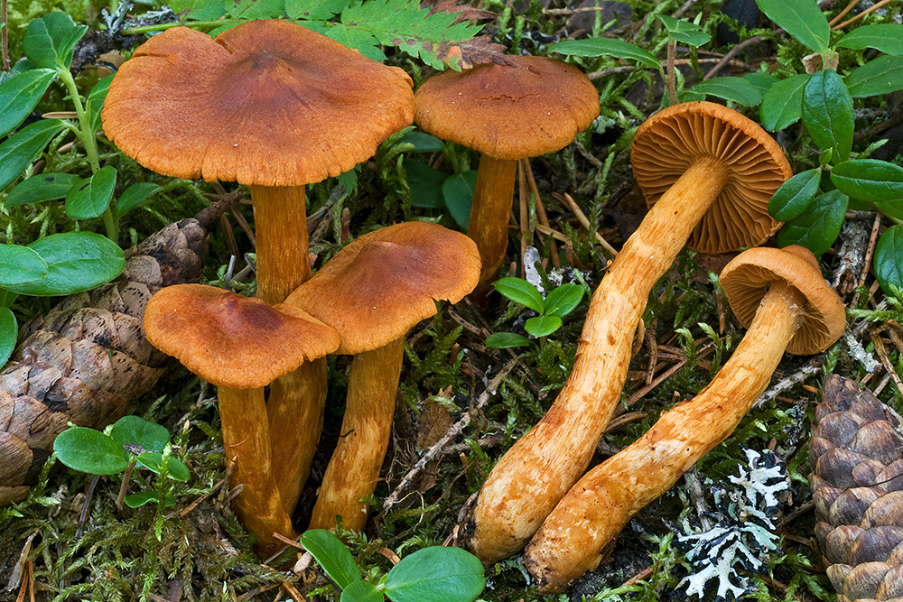
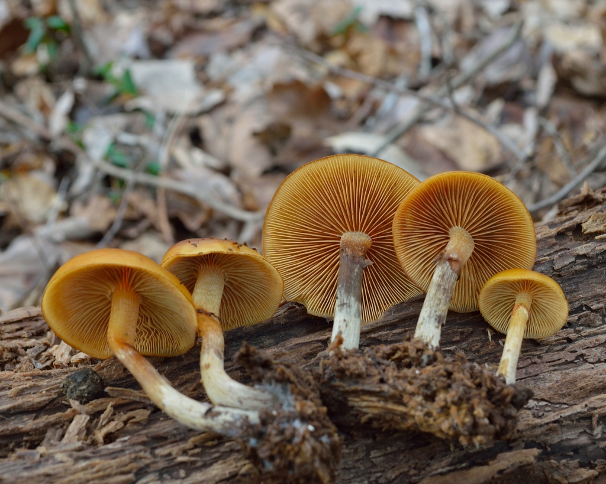
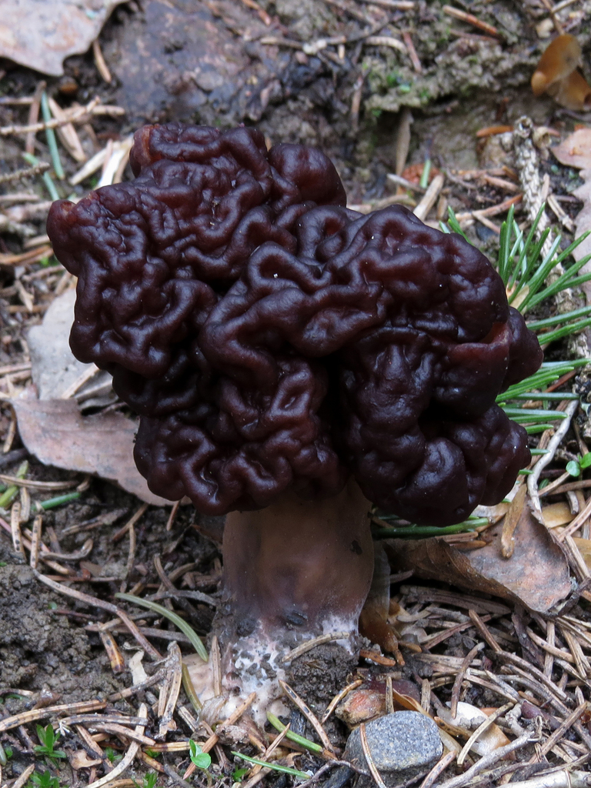
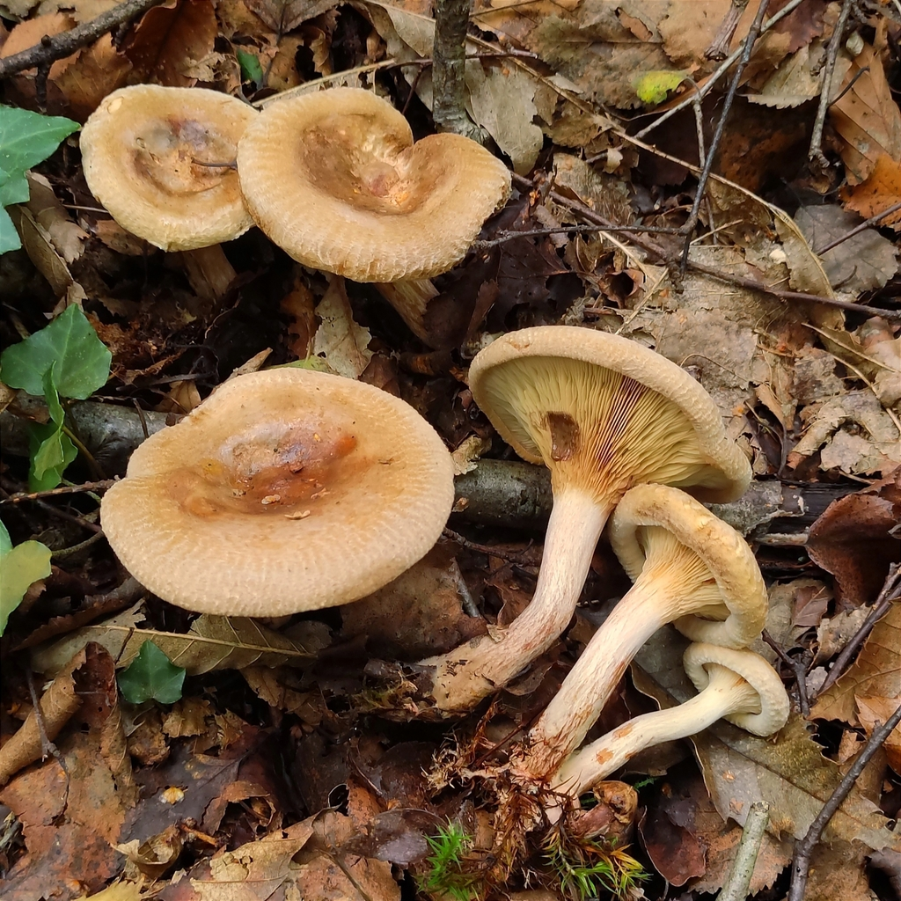

# 04. Deadly & Toxic Species: The Survival Manual

> [!CAUTION]
> **MUSHROOM POISONING EMERGENCY PROTOCOL**
> - **Finnish Poison Information Centre (*Myrkytystietokeskus*)**:
>   - **0800 147 111** (Toll-free 24/7 across Finland)
>   - **+358 9 471 977** (Standard mobile/international rate)
> - **General Emergency**: **112**
> - **DO NOT INDUCE VOMITING** unless explicitly instructed by the Poison Information Centre.
> - **Save All Specimens**: Keep raw leftovers, peelings, or cleaning scraps in a paper bag or bowl in the fridge. Emergency doctors need these for microscopic spore analysis to determine if amatoxin or orellanine antidotes are required.

Finland is home to several **deadly poisonous mushrooms** that contain toxins resistant to boiling, drying, and freezing. Two of the most lethal—*Amanita virosa* and *Cortinarius rubellus*—grow commonly in the mossy spruce and pine forests directly surrounding Helsinki.

---

## 1. Destroying Angel (*Amanita virosa* / *Valkokärpässieni*)
**Status**: ☠️☠️☠️ **DEADLY POISONOUS (Tappavan myrkyllinen)**

*(c) Scientific field observation - Pure white fruiting body with sack-like volva at stem base*

### Macro-Morphological Identification Keys
- **Cap**: 5–12 cm. Pure silky white, occasionally ivory or yellowish at the center when aged. Conical-bell shaped when young, expanding to convex with ragged edges.
- **Gills (*Heltat*)**: **PURE WHITE**, free from the stem, crowded. Never turn brown or pink.
- **Stem (*Jalka*)**: 8–15 cm tall, slender, pure white, with a shaggy/scaly surface (*sukeltajamainen*).
- **Ring (*Rengas*)**: Thin, delicate, skirt-like white ring on the upper stem (can tear or stick to cap margin in heavy rain).
- **Volva / Universal Veil Sac (*Tuppi*)**: **CRITICAL FEATURE**. A distinct, loose, bag-like white cup at the swollen base of the stem, often buried 3–7 cm deep inside thick green moss.
- **Flesh & Odor**: Pure white, unchanging. Faint sickly sweet, unpleasantly cloying or radish-like when mature.

### Habitat in Helsinki Region
- Mesic Norway spruce forests (*tuore kangas*), mixed spruce-birch stands, rich moss blankets (*Hylocomium*, *Pleurozium*).
- Common in **Keskuspuisto (Pitkäkoski)**, **Sipoonkorpi**, **Nuuksio**, and **Luukki**.
- Season: **August to October**.

### Toxin & Clinical Pathology: Amatoxins
- **Mechanism**: Alpha-amanitin irreversibly binds to and inhibits RNA polymerase II in human liver and kidney cells, halting protein synthesis and triggering massive cell necrosis.
- **The Treacherous Three-Phase Progression**:
  1. **Asymptomatic Latency (6–24 hours)**: The patient feels completely healthy while toxins silently destroy liver tissue.
  2. **Gastrointestinal Collapse (Day 2)**: Violent, cholera-like watery diarrhea, severe vomiting, abdominal cramping, and rapid dehydration.
  3. **Apparent Recovery (Day 3)**: Gastrointestinal symptoms temporarily abate ("false remission").
  4. **Fulminant Hepatorenal Failure (Days 4–7)**: Jaundice, coagulopathy (internal bleeding), hepatic encephalopathy, coma, and multi-organ failure. Mortality is high without emergency Silibinin therapy or emergency liver transplantation.

### Deadly Confusion Risks
- **Meadow / Wood Mushrooms (*Agaricus* / *Herkkusienet*)**: Edible button mushrooms have brown-to-chocolate gills in maturity, never pure white gills. **Rule: Novices in Finland must NEVER pick white-gilled white mushrooms.**

---

## 2. Deadly Webcap (*Cortinarius rubellus* / *Suippumyrkkyseitikki*)
**Status**: ☠️☠️☠️ **DEADLY POISONOUS (Tappavan myrkyllinen)**

*(c) Scientific field observation - Cinnamon-brown conical cap with distinct pointed umbo*

### Macro-Morphological Identification Keys
- **Cap**: 3–8 cm. Uniformly reddish-brown, cinnamon-brown, or rusty copper. Distinctly **pointed / conical umbo** in the center (like a miniature wizard’s hat). Dry, finely fibrous to velvety texture.
- **Gills (*Heltat*)**: Broadly spaced, thick, rusty-cinnamon or red-brown (colored by rusty spores). Attached to the stem.
- **Stem (*Jalka*)**: 5–12 cm tall, cylindrical, same cinnamon color as cap, adorned with **yellowish zigzag banding (*siksak-vyöt*)** from veil remnants.
- **Cortina**: In young buttons, a cobweb-like fibrous veil (*kortiina*) stretches from the cap margin to the stem.
- **Flesh & Odor**: Reddish-yellow to pale cinnamon. Faint odor of raw radish or freshly turned turnip.

### Habitat in Helsinki Region
- Damp, mossy, acidic Norway spruce heaths (*mustikkatyypin kuusikko*), edges of spruce mires (*korpi*), sphagnum-filled depressions.
- **EXTREME DANGER**: It frequently grows **intermingled right beside blueberry bushes and Golden Chanterelles** in Nuuksio, Sipoonkorpi, and Vaakkoi!
- Season: **August to October**.

### Toxin & Clinical Pathology: Orellanine
- **Mechanism**: Orellanine is a powerful bipyridine nephrotoxin that selectively attacks and destroys renal proximal tubular cells.
- **The Long Latency Nightmare (2 to 14 Days!)**:
  - The victim often shows **zero symptoms for up to two full weeks** after eating the meal!
  - By the time intense thirst (*polydipsia*), frequent or ceased urination, lower back pain, chills, and severe headache appear, the kidneys have suffered permanent, irreversible fibrotic damage.
  - Many victims require life-long hemodialysis or a donor kidney transplant.

### Deadly Confusion Risks
- Novices hunting for **Golden Chanterelles** (*Cantharellus cibarius*) or **Funnel Chanterelles** (*Craterellus tubaeformis*) who hurriedly pluck handfuls of mushrooms out of deep moss without inspecting every single specimen individually.

---

## 3. Funeral Bell (*Galerina marginata* / *Myrkkynääpikkä*)
**Status**: ☠️☠️☠️ **DEADLY POISONOUS (Tappavan myrkyllinen)**

*(c) Scientific field observation - Small brown wood-rotting mushroom with stem ring*

### Macro-Morphological Identification Keys
- **Cap**: 1.5–4.5 cm. Ochre-brown, honey-brown to watery cinnamon. Conical then flattening with a slight central bump. Striated margin when damp (*hygrophanous*).
- **Gills**: Crowded, ochre-brown, darkening to rusty cinnamon.
- **Stem**: Slender (2–6 mm thick), brownish, with a **small membranous ring (*rengas*)** on the upper half, and silvery-white longitudinal fibrillose striations below the ring.
- **Substrate**: **Grows strictly on decaying wood**—rotting conifer stumps, fallen mossy logs, buried wood chips.
- **Toxin**: Contains the **exact same lethal amatoxins** as the Destroying Angel (*Amanita virosa*).

### Deadly Confusion Risks
- **Sheathed Woodtuft (*Kuehneromyces mutabilis* / *Koivunkantosieni*)**:
  - *Kuehneromyces mutabilis* is a prized edible wood-decay mushroom that also grows in clusters on stumps.
  - **Differentiating Key**: The stem of the edible *Kuehneromyces* is covered in **dense, dark, bristly backward-curving scales (*pörröiset tummat suomut*)** beneath the ring. The deadly *Galerina* has a **smooth or silky-silvery fibrillose stem** without coarse scales.
  - **Rule**: Never harvest wood-growing cluster mushrooms unless you inspect the stem scales of *every single individual mushroom*. If unsure, leave all woodtufts alone.

---

## 4. False Morel (*Gyromitra esculenta* / *Korvasieni*)
**Status**: ☠️☠️☠️ **DEADLY TOXIC RAW / TRADITIONAL FINNISH DELICACY**

*(c) Scientific field observation - Brain-like convoluted red-brown cap*

### Identification & Ecology
- **Cap**: 5–12 cm across, reddish-brown to dark chestnut. Distinctly **brain-like, folded, convoluted lobes** (never pitted like true morels / *Morchella*). Hollow and chambered inside.
- **Habitat**: Sandy, disturbed soil in pine forests, logging tracks, sandy path sides.
- **Season**: **May to early June**.

### Toxin: Gyromitrin
- **Metabolism**: In the human stomach and liver, gyromitrin hydrolyzes into **monomethylhydrazine (MMH)**—a volatile hydrazine compound used as rocket propellant!
- **Symptoms**: Severe vomiting, neurological disorders, convulsions, hemolysis, toxic hepatitis. Inhaling the steam during boiling can also cause severe poisoning!
- **Mandatory Finnish Parboiling Protocol (*Keitto-ohje*)**:
  - The Finnish Food Authority (*Ruokavirasto*) mandates that fresh *korvasieni* must be **boiled twice in abundant water (1 part mushrooms to at least 3 parts water) for at least 5 minutes each time**.
  - Between the two boilings, the mushrooms must be thoroughly rinsed under running cold water.
  - The boiling water contains dissolved MMH and **MUST BE DISCARDED**. Never use it in cooking!
  - **Ventilation**: Boil only with the kitchen range hood on maximum exhaust or outdoors.

---

## 5. Brown Rollrim (*Paxillus involutus* / *Pulkkosieni*)
**Status**: ☠️☠️ **TOXIC / CHRONIC IMMUNOLOGICAL DANGER**

*(c) Scientific field observation - Distinctly in-rolled velvet cap margin and bruising gills*

### Identification & Ecology
- **Cap**: 5–15 cm. Ochre-brown to olive-brown. The **outer edge of the cap is strongly rolled inwards (*sisäänkiertynyt reuna*)** and remains curled even in maturity.
- **Gills**: Yellowish-olive to brown, easily detached from cap flesh, and **bruise instantly dark brown when pressed with a finger**.
- **Habitat**: Very common in Helsinki urban parks, birch groves, roadsides, and spruce borders.

### Danger: The Paxillus Syndrome
- In older Eastern European and Soviet guidebooks, *Paxillus involutus* was listed as edible after boiling.
- **Modern Medical Reality**: It contains an unknown antigen that provokes an autoimmune reaction in the human body. With repeated consumption (sometimes after years of eating it without incident), the immune system produces antibodies that suddenly trigger **massive autoimmune hemolysis**—the body's own immune system destroys its red blood cells, leading to acute kidney failure, shock, and fatal hemolytic anemia. It is strictly classified as poisonous.

---

## Summary Matrix of Dangerous Species

| Species | Finnish Name | Key Warning Sign | Primary Toxin | Target Organ / Hazard |
| :--- | :--- | :--- | :--- | :--- |
| ***Amanita virosa*** | Valkokärpässieni | Pure white, white gills, stem ring & basal cup | Amatoxins | Liver necrosis (6–24 hr latency) |
| ***Cortinarius rubellus*** | Suippumyrkkyseitikki | Pointed cinnamon cap, yellow zigzag stem bands | Orellanine | Permanent kidney destruction (2–14 day latency) |
| ***Galerina marginata*** | Myrkkynääpikkä | Small brown wood-grower, ring on smooth stem | Amatoxins | Liver destruction |
| ***Gyromitra esculenta*** | Korvasieni | Convoluted brain-like folds in spring | Gyromitrin | Nervous system, liver (volatile MMH) |
| ***Paxillus involutus*** | Pulkkosieni | In-rolled velvet margin, gills bruise brown | Paxillus antigen | Autoimmune red blood cell hemolysis |
| ***Amanita muscaria*** | Punakärpässieni | Bright red cap with white warts | Ibotenic acid, Muscimol | Central nervous system delirium |
