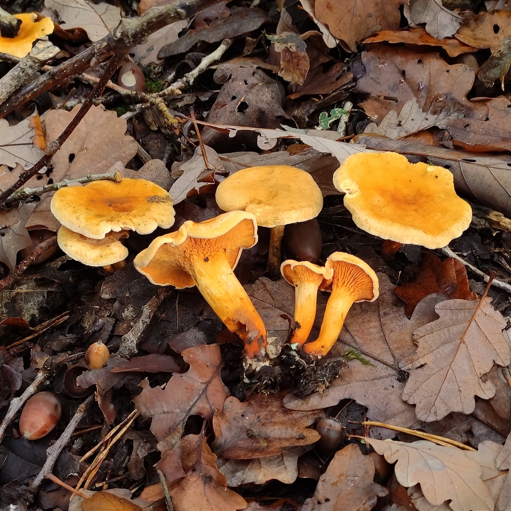
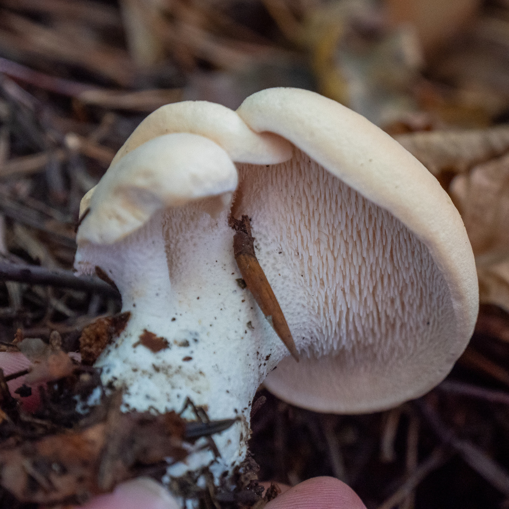
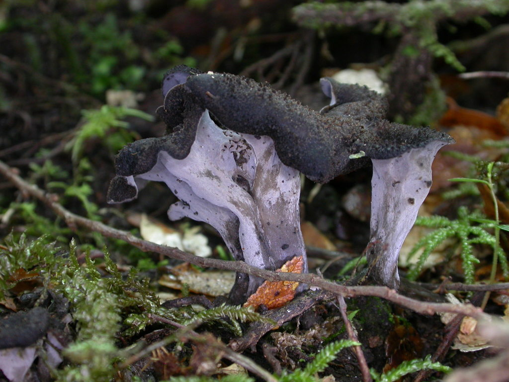
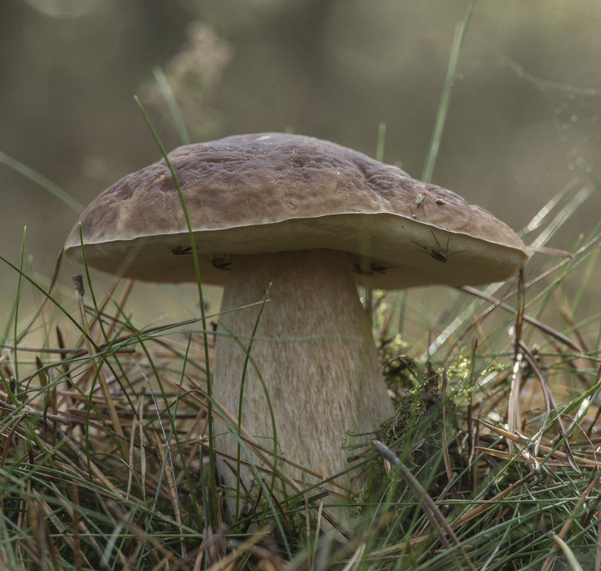
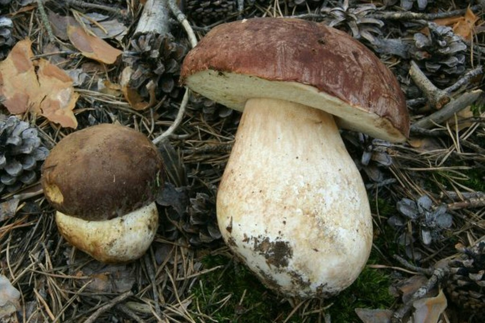
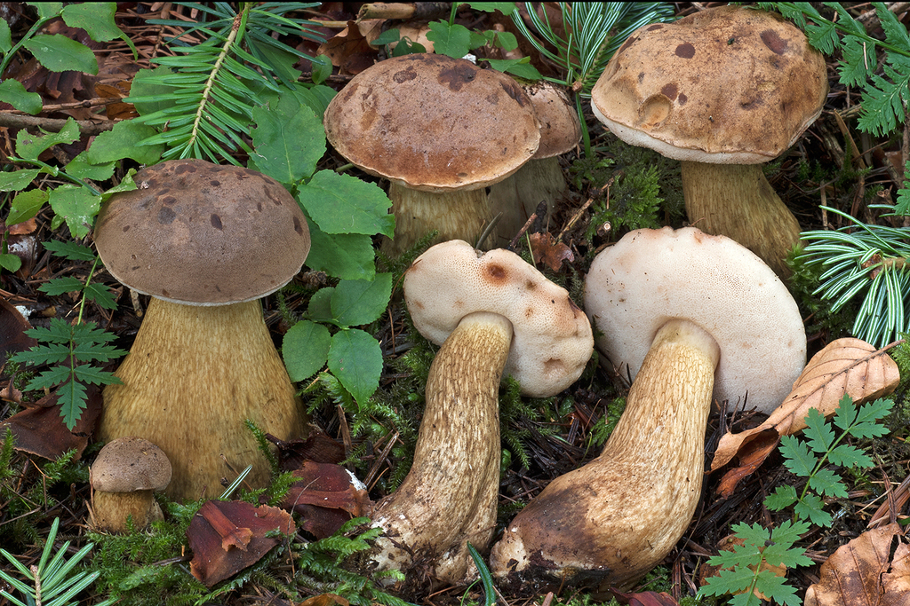

# 05. The "Safe Five" Beginner Mushrooms of Southern Finland

If you are new to foraging in Finland, start exclusively with these five species. Each has **unmistakable macroscopic characteristics** (false gills, hollow funnels, ventral spines, or sponge-like pores) and **no deadly lookalikes** when following simple verification rules.

---

## 1. Golden Chanterelle (*Cantharellus cibarius* / *Keltavahvero* / *Kantarelli*)
**Finnish Rating**: `***` **Erinomainen ruokasieni (Choice Edible)**

*(c) Scientific field observation - Egg-yellow wavy cap with decurrent blunt vein-like ridges*

### Identification Checklist
- **Cap**: 3–10 cm across. Bright egg-yolk yellow to golden orange. Irregular, undulating, wavy margin that curves downwards when young, flaring outward into a trumpet shape as it matures.
- **Under-Cap Structure**: **FALSE GILLS (Poimut)**. These are not true, thin, paper-like gills! They are thick, blunt, vein-like ridges (*poimut*) that repeatedly fork and branch, running significantly down the stem (*decurrent*). They cannot be cleanly scraped away from the cap.
- **Stem**: Firm, solid, tapering toward the base, colored exactly like the cap.
- **Flesh**: Dense, fibrous, pale cream to pale yellow inside. **Never hollow** in fresh specimens.
- **Smell**: Distinctly **fruity, resembling ripe apricots or mirabelle plums**.

### Helsinki Habitats & Season
- **Habitat**: Mossy birch-spruce edges, along forest paths, sandy trail margins, moss-covered bedrock benches in **Keskuspuisto (Paloheinä)**, **Nuuksio**, and **Luukki**.
- **Season**: **July to October** (peak in August).

---

### Lookalike Check: False Chanterelle (*Hygrophoropsis aurantiaca* / *Valekantarelli*)
**Status**: `*` Edible but bland / Not poisonous, but inferior.

*(c) Scientific field observation - Note the sharp, thin, knife-edge true gills and bright orange coloration*

| Feature | Golden Chanterelle (*Keltavahvero*) | False Chanterelle (*Valekantarelli*) |
| :--- | :--- | :--- |
| **Underside** | **Blunt, thick, branched ridges (*poimut*)** | **Thin, sharp, crowded true gills (*oikeat heltat*)** |
| **Color** | Egg-yolk yellow, golden yellow | Intense electric orange to tawny reddish-orange |
| **Flesh** | Firm, meaty, pale yellowish-white | Soft, flexible, thin, orange flesh |
| **Stem** | Solid, thick, yellow throughout | Slender, often darker/brownish near the base |
| **Smell** | Fresh fruity apricot fragrance | Mild, mushroomy or indistinct |

---

## 2. Funnel Chanterelle / Yellow Foot (*Craterellus tubaeformis* / *Suppilovahvero*)
**Finnish Rating**: `***` **Erinomainen ruokasieni (Choice Edible)**

*(c) Scientific field observation - Brown trumpet cap with bright yellow hollow stem*

### Identification Checklist
- **Cap**: 2–6 cm. Yellow-brown, grey-brown, or olive-brown. Distinctly **trumpet-shaped with a deep central funnel** that pierces straight into the hollow stem.
- **Underside**: Greyish-yellow to ash-grey ridges (*poimut*), blunt, branched, running down the stem.
- **Stem**: 3–8 cm tall, 4–8 mm wide. **Bright golden-yellow or yellowish-orange**, flattened or grooved, and **COMPLETELY HOLLOW** like a drinking straw.
- **Flesh**: Thin, pliable, fragrant, yellowish.
- **Smell**: Pleasant, earthy, slightly spicy and fruity.

### Helsinki Habitats & Season
- **Habitat**: Deep, moist feather-moss blankets (*Pleurozium*, *Hylocomium*) in mature Norway spruce forests. Often hidden beneath fallen leaves.
- **Where to Find**: **Sipoonkorpi** (legendary hauls near Bisajärvi and Kuusijärvi), **Pitkäkoski**, **Vaakkoi**.
- **Season**: **September to late November** (even after multiple sub-zero frosts!).

> [!IMPORTANT]
> **Safety Check against Deadly Webcap (*Cortinarius rubellus*)**:
> Because Funnel Chanterelles grow hidden deep inside damp moss cushions where *Cortinarius rubellus* also lives, **NEVER grab handfuls of mushrooms blind**.
> - Funnel Chanterelles have a **completely hollow, yellow tube stem** and a **perforated funnel cap**.
> - The Deadly Webcap has a **solid, cinnamon-brown stem with yellow zigzag bands** and a **pointed cone cap**.

---

## 3. Wood Hedgehog (*Hydnum repandum* & *Hydnum rufescens* / *Vaaleaorakas* & *Rusko-orakas*)
**Finnish Rating**: `***` **Erinomainen ruokasieni (Choice Edible)**

*(c) Scientific field observation - Underside covered in dense, fragile spines (orakkaat)*

### Identification Checklist
- **Cap**: 4–15 cm across. Creamy ivory, pale buff, or biscuit-colored (*H. repandum*); reddish-terracotta in the smaller *H. rufescens*. Irregular, thick, firm, slightly undulating.
- **Under-Cap Structure**: **SPINES / TEETH (Orakset)**. Instead of gills or pores, the underside is covered with **thousands of tiny, fragile, soft white-to-cream spines** (2–6 mm long).
  - You can brush these spines off easily with your fingertip.
  - **There are NO poisonous mushrooms with spines underneath caps in Finland!**
- **Stem**: Thick, solid, off-white, often eccentric.
- **Flesh**: Crisp, brittle, snapping like chalk. Pure white, bruising slowly yellowish-orange.
- **Culinary Advantage**: Extremely resistant to maggots and insect larvae; almost 100% of collected specimens are solid and clean.

### Helsinki Habitats & Season
- **Habitat**: Mossy spruce hollows, shaded birch-spruce slopes in **Luukki**, **Sipoonkorpi**, **Keskuspuisto (Pirkkola)**.
- **Season**: **August to October**.

---

## 4. Black Trumpet / Horn of Plenty (*Craterellus cornucopioides* / *Mustatorvisieni*)
**Finnish Rating**: `***` **Erinomainen ruokasieni (Choice Edible - "Black Gold")**

*(c) Scientific field observation - Jet-black to dark grey hollow trumpet*

### Identification Checklist
- **Fruitbody**: 3–8 cm wide, 4–10 cm tall. **Entire mushroom is a thin, hollow, trumpet-shaped horn** flaring open at the top with a wavy, ragged, rolled-back rim.
- **Color**: Soot-black, charcoal, or dark ash-grey when damp; drying to pale grey or brownish-black.
- **Underside / Outer Surface**: Smooth or slightly wrinkled, ash-grey, with **no gills, ridges, pores, or spines**.
- **Flesh**: Thin, pliable, elastic, dry, dark grey.
- **Smell**: Intensely aromatic, floral, fruity, reminiscent of dried black truffles.
- **Zero Poisonous Lookalikes**: There is no toxic mushroom in Northern Europe that looks like a black hollow trumpet.

### Helsinki Habitats & Season
- **Habitat**: Warm, moist, herb-rich deciduous groves (*lehto*) under **European hazel (*Corylus avellana*)**, birch, and oak.
- **Where to Find**: **Keskuspuisto (Maunula hazel groves)**, **Petikko**, **Nuuksio (Kattila slopes)**.
- **Season**: **August to October**.

---

## 5. King Bolete / Porcini (*Boletus edulis* & *Boletus pinophilus* / *Herkkutatti* & *Männynherkkutatti*)
**Finnish Rating**: `***` **Erinomainen ruokasieni (Choice Edible)**

*(c) Scientific field observation - Bun-brown cap, white-to-olive spongy pores, club-shaped net-veined stem*

*(c) Scientific field observation - Deep mahogany reddish cap under Scots pine*

### Identification Checklist
- **Cap**: 8–25 cm across. Hemispherical then convex, resembling a toasted bread roll. Pale brown to greasy chestnut (*B. edulis*), or dark wine-red mahogany (*B. pinophilus*).
- **Under-Cap Structure**: **PORES / SPONGE (Pillit)**. A spongy, detachable layer of vertical tubes:
  - **White when young** (firm like butter),
  - Turning **yellowish-green to olive-green** in maturity.
  - **Never red or pink** in *Boletus edulis*.
- **Stem**: Robust, swollen, club-shaped or barrel-shaped. Covered with a **fine white raised net pattern (*verkkokuvio*)** near the top of the stem.
- **Flesh**: Pure white, firm, solid. **DOES NOT TURN BLUE OR BLACK WHEN CUT**.
- **Smell & Taste**: Pleasant nutty fragrance, sweet and nutty on the tongue.

### Helsinki Habitats & Season
- **Habitat**: Mature spruce-blueberry forests (*tuore kangas*) for *B. edulis*; sandy pine heaths (*kuiva kangas*) for *B. pinophilus*.
- **Where to Find**: **Sipoonkorpi (Kuusijärvi / Bisajärvi)**, **Luukki**, **Nuuksio**.
- **Season**: **August to late September**.

---

### Lookalike Check: Bitter Bolete (*Tylopilus felleus* / *Sappitatti*)
**Status**: `O` **Inedible due to extreme, tongue-numbing bitterness (Not deadly toxic, but ruins an entire stew).**

*(c) Scientific field observation - Distinctive coarse dark-brown network on stem and pinkish pore tint*

| Feature | King Bolete (*Herkkutatti*) | Bitter Bolete (*Sappitatti*) |
| :--- | :--- | :--- |
| **Pores (*Pillit*)** | Pure white when young, turning **yellowish-green / olive** | White when young, turning **dirty pink / brownish-pink** |
| **Stem Netting** | **Delicate white network** on pale brownish background | **Coarse, dark brown, prominent raised netting** on stem |
| **The Taste Test** | Touch a tiny piece of raw cap to the tip of your tongue: **mild and nutty** | Touch a tiny piece to your tongue: **violently bitter within 5 seconds** (spit it out) |
