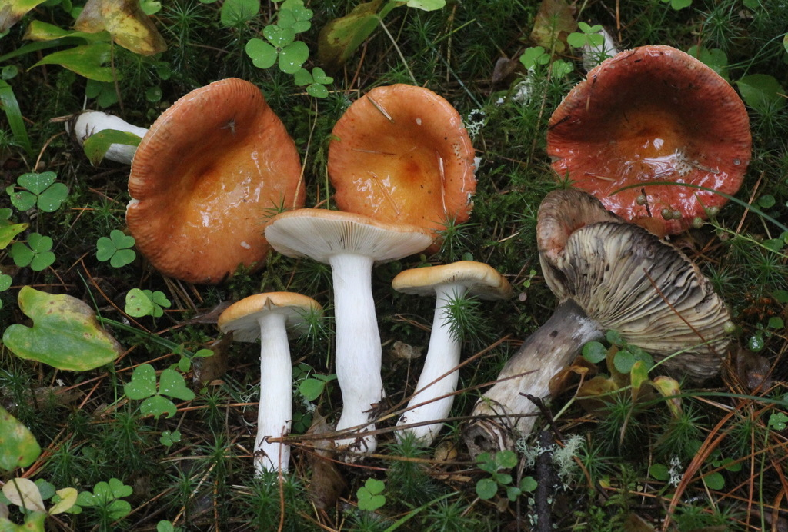
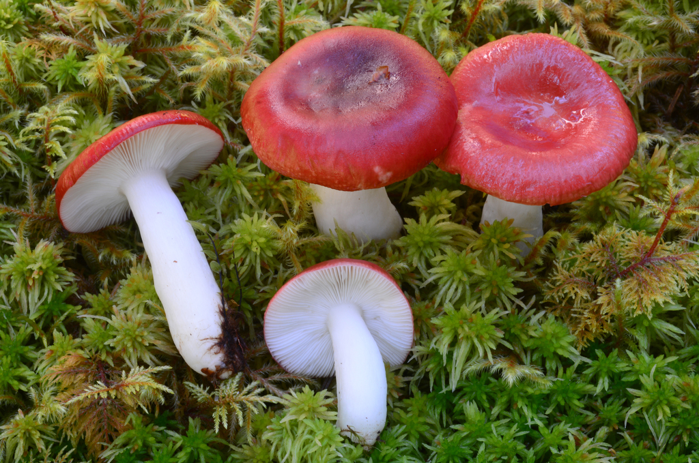
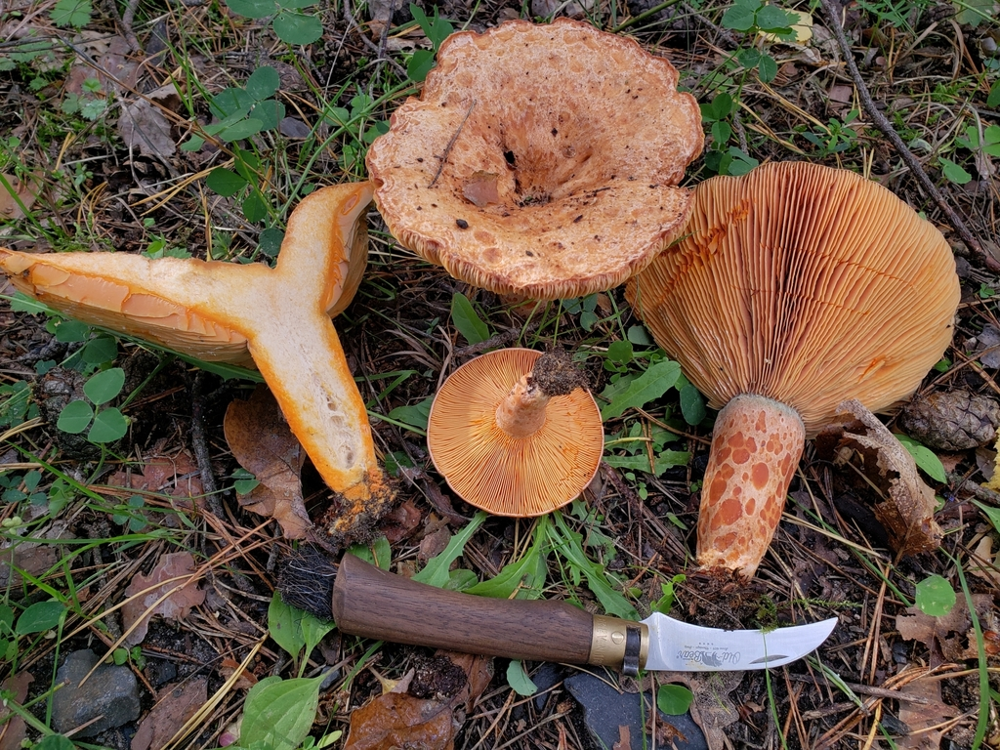
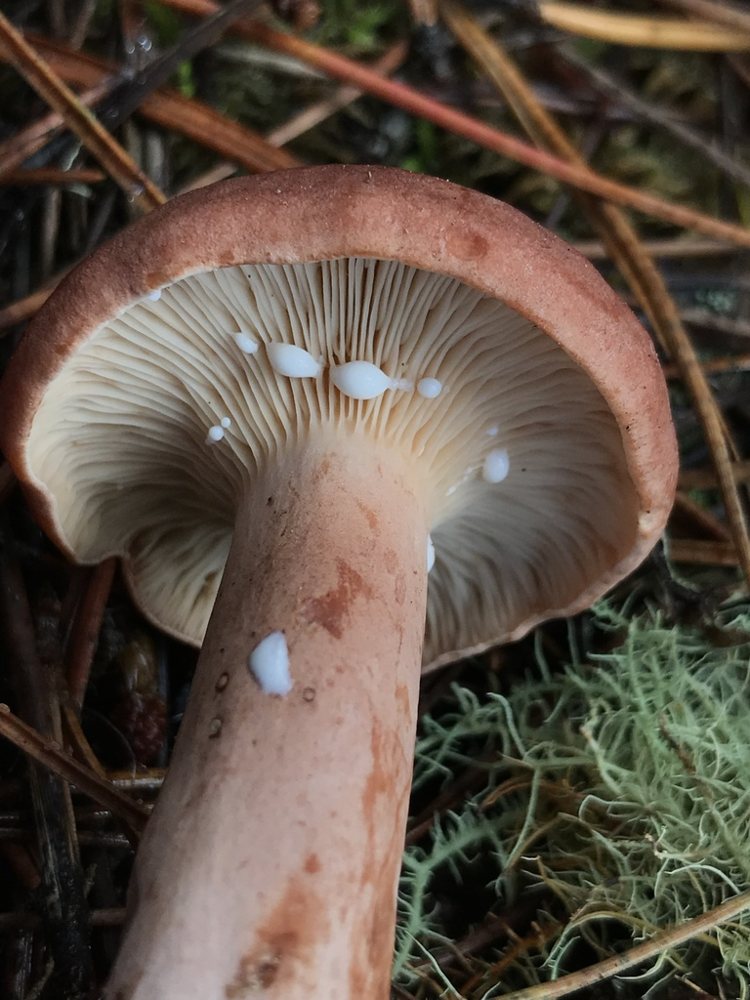
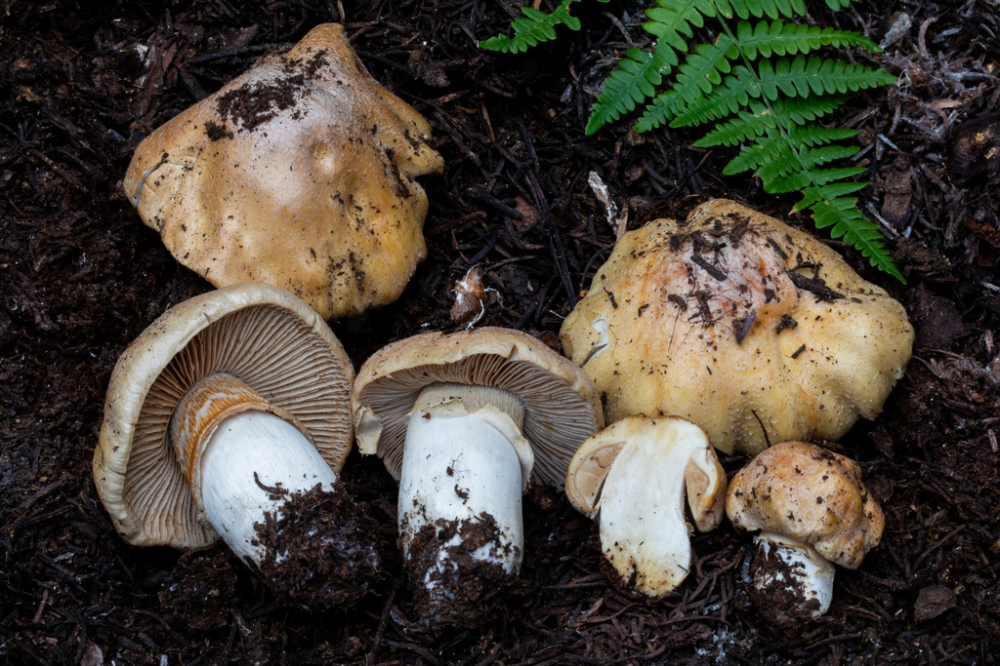
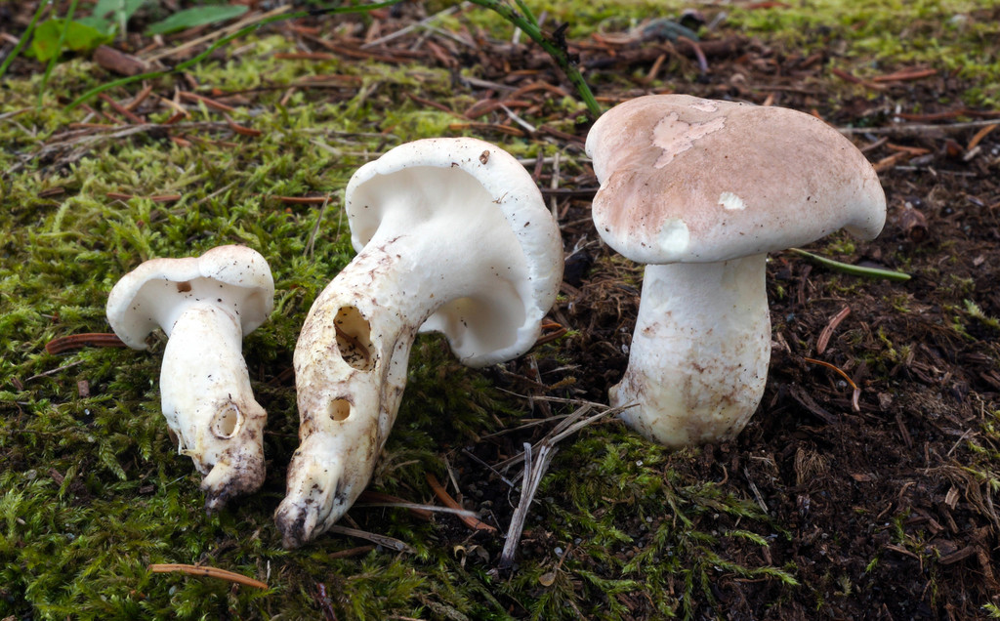
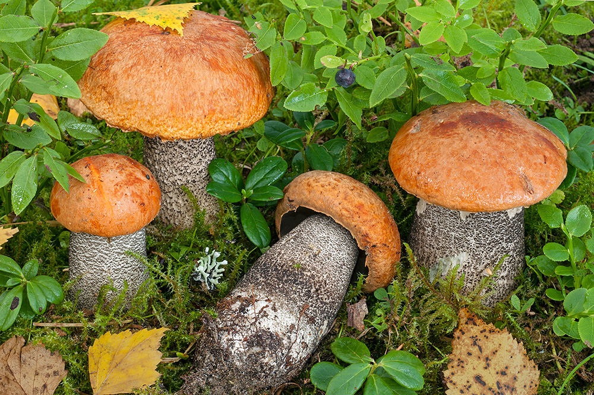

# 06. Intermediate & Advanced Edible Species of Southern Finland

Once you have mastered the "Safe Five," you can expand into the rich culinary traditions of Finland. This chapter covers the two staple families of Finnish foraging—**Brittlegills (*Haperot*)** and **Milkcaps (*Rouskut*)**—along with the prized **Gypsy Mushroom**, **Sheep Polypore**, and **Scaber Stalks**.

---

## 1. Brittlegills (*Russula* / *Haperot*)
**Culinary Value**: `***` to `**` for mild species.

*(c) Scientific field observation - Copper-orange cap, brittle chalk-like gills, greyish bruised stem*

### The Unique Anatomy of Russulas
- **Flesh Structure**: Russula tissue consists of spherical cell clusters (*sphaerocysts*) rather than long fungal fibers. Consequently, the stem **snaps cleanly like a crisp apple or a piece of chalk**, leaving no fibrous strands.
- **Under-Cap Structure**: True, brittle gills that fracture easily into flakes when brushed.
- **NO Latex**: Unlike Milkcaps, Russulas never exude milky droplets when cut.
- **NO Ring and NO Volva**: Stems are completely naked (no ring, no basal cup).

---

### The Foolproof Finnish "Russula Taste Test" (*Haperosääntö*)
The genus *Russula* contains dozens of species in Finland. Luckily, you do not need to identify every individual scientific species to know if it is safe to eat!

> [!IMPORTANT]
> **HOW TO PERFORM THE RUSSULA TASTE TEST:**
> 1. **Confirm the genus first**: Verify the mushroom has brittle chalk-snapping flesh, true gills, **no milky liquid**, **no ring**, and **no volva**.
> 2. Break off a piece of the cap the size of a pea.
> 3. Place it on the tip of your tongue and chew gently with your front teeth for 5–10 seconds. **DO NOT SWALLOW**.
> 4. **Interpretation**:
>    - **Mild, sweet, nutty, or mushroomy**: It is **SAFE AND EDIBLE**! You can cook it immediately.
>    - **Peppery, burning, acrid, or bitter**: It is **UNFIT FOR CONSUMPTION**. Spit it out completely.
>
> *(Note: This test applies ONLY to verified Russula species. Never taste-test Amanitas or Cortinarius!)*

---

### Toxic / Inedible Lookalike: The Sickener (*Russula emetica* / *Tulipunahapero*)
**Status**: ☠️ **TOXIC / GASTROINTESTINAL IRRITANT**

*(c) Scientific field observation - Bright scarlet-red cap, snow-white gills, violently burning taste*

- **Cap**: Scarlet red, shiny when wet.
- **Taste Test**: Burning, intensely peppery within 3 seconds. Causes severe vomiting and stomach upset if swallowed raw or fried.

---

## 2. Milkcaps (*Lactarius* / *Rouskut*)
*The cornerstone of Finnish autumn food culture*

Milkcaps share the same brittle, chalk-like flesh as Russulas, but with one defining biological marker: **when cut or bruised, they exude milky liquid (*maitoneste*)**.

In Finnish cuisine, milkcaps are divided into two culinary categories:
1. **Directly Edible Milkcaps (*Miedot rouskut*)**: Sweet or mild latex; can be pan-fried directly with butter.
2. **Acrid Salting Milkcaps (*Kirpeät rouskut*)**: Peppery or bitter latex; **require parboiling (*ryöppäys*)** before pickling or salting for *sienisalaatti*.

---

### A. Saffron Milkcap (*Lactarius deliciosus* / *Männynleppärousku*)
**Finnish Rating**: `***` **Erinomainen ruokasieni (Choice Edible - No Parboiling Required!)**

*(c) Scientific field observation - Orange zoned cap, carrot-orange milk, bruising green*

- **Cap**: 4–12 cm. Warm carrot-orange, marked with concentric darker rings (*zoned*). In age or when damaged, it develops **emerald-green stains**.
- **Milky Latex**: **BRIGHT CARROT-ORANGE**. It never turns white.
- **Stem**: Hollow in maturity, with orange crater-like pit depressions (*tupsut*).
- **Culinary Use**: One of the finest mushrooms in Europe. Slice and sauté in hot butter with sea salt; never boil in water!

---

### B. Woolly Milkcap (*Lactarius torminosus* / *Karvarousku*)
**Finnish Rating**: `!` -> `***` **Toxic raw; Choice when parboiled (*Ryöpättävä*)**

*(c) Scientific field observation - Characteristic shaggy, hairy rolled margin and pinkish cap*

- **Cap**: 5–12 cm. Pinkish-salmon, concentric zones, with a **dense woolly, hairy beard around the inrolled margin (*karvainen reuna*)**.
- **Milky Latex**: Pure white, unchanging. Extremely peppery and burning on the tongue.
- **Tree Partner**: Strictly mycorrhizal with **Silver birch (*Betula*)**.
- **Processing**: Must be **parboiled in boiling water for 10 minutes**, drained, and rinsed in cold water. It forms the base of the traditional Finnish Christmas salad (*sienisalaatti*).

---

### C. Rufous Milkcap (*Lactarius rufus* / *Kangasrousku*)
**Finnish Rating**: `!` -> `**` **Toxic raw; Staple salting mushroom when parboiled**

*(c) Scientific field observation - Terracotta-brown cap with sharp pointed central papilla*

- **Cap**: 3–8 cm. Dark reddish-terracotta, dry, with a **distinct sharp conical pimple/papilla (*nypy*)** at the center.
- **Milky Latex**: Abundant, watery white, blistering peppery on the throat.
- **Habitat**: Dry Scots pine heaths (*kuiva kangas*) among lingonberry and lichens.
- **Processing**: **Parboil for 10 minutes** to eliminate acridity.

---

## 3. Gypsy Mushroom (*Cortinarius caperatus* / *Kehnäsieni*)
**Finnish Rating**: `***` **Erinomainen ruokasieni (Choice Edible)**

*(c) Scientific field observation - Straw-yellow cap with silvery frosted veil powder (kehnä)*

### Identification Keys
- **Cap**: 5–12 cm. Straw-yellow, ochre, or pale honey-buff. Wrinkled center covered in a **silvery-white, frosted, flour-like sheen (*kehnä*)**.
- **Gills**: Pale clay-yellow, maturing to cinnamon-brown, with finely serrated, wavy edges.
- **Stem**: Sturdy, pale buff, adorned with a **distinct, membranous, persistent yellowish-white ring (*rengas*)** midway up.
- **Flesh**: Pale yellowish-white, firm, with a delicate, mildly sweet, mushroomy aroma.

> [!CAUTION]
> Because it belongs to the genus *Cortinarius*, novice foragers must carefully check for:
> 1. The **silvery frosted coating** on the cap center,
> 2. The **firm membranous ring** on the stem,
> 3. The **lack of sharp pointed conical umbo** and absence of yellow zigzag bands (to avoid *Cortinarius rubellus*).

---

## 4. Sheep Polypore (*Albatrellus ovinus* / *Lampaankääpä*)
**Finnish Rating**: `***` **Erinomainen ruokasieni (Choice Edible)**

*(c) Scientific field observation - Irregular creamy cap, tiny white pores, growing terrestrially on moss*

### Identification Keys
- **Cap**: 6–20 cm. Irregular, wavy, pale cream to dirty greyish-white, cracking into mosaic patches when dry.
- **Under-Cap Structure**: **Extremely tiny, dense, white pore layer** running slightly down the stem.
- **Habitat**: Terrestrial on moss in old Norway spruce forests (never on tree trunks).
- **The Magic Color Shift**: When placed in a hot pan with butter, **the pure white flesh turns vibrant lemon-yellow (*sitruunankeltainen*)**. If it turns yellow, you have 100% genuine *Albatrellus ovinus*!
- **Lookalike Comparison**: *Albatrellus confluens* (*Typpikääpä*) looks similar but has a more apricot-buff cap and **turns dull brownish-orange when cooked, tasting bitter**.

---

## 5. Orange Birch Bolete (*Leccinum versipelle* / *Koivunpunikkitatti*)
**Finnish Rating**: `***` **Erinomainen ruokasieni (Choice Edible - Requires Thorough Cooking)**

*(c) Scientific field observation - Vivid brick-orange cap and stem covered in black scaber scales*

### Identification Keys
- **Cap**: 8–20 cm. Vivid brick-red, orange-red, or apricot. Dry, suede-like texture, with the cap skin overhanging the edge slightly.
- **Pores**: Greyish-white, darkening to brownish-grey in age.
- **Stem**: Tall, firm, solid, covered with **prominent black woolly scales (*mustat nukkatupsut*)** on a white background.
- **Flesh**: Solid white when cut, **rapidly staining violet-grey, then dark blue-black**.

> [!WARNING]
> **Mandatory Cooking Time**: All *Leccinum* species (punikkitatit and lehmäntatit) contain heat-labile toxins that cause acute stomach cramps, vomiting, and nausea if undercooked. **Always cook in a pan or simmer for at least 15 to 20 minutes.**
