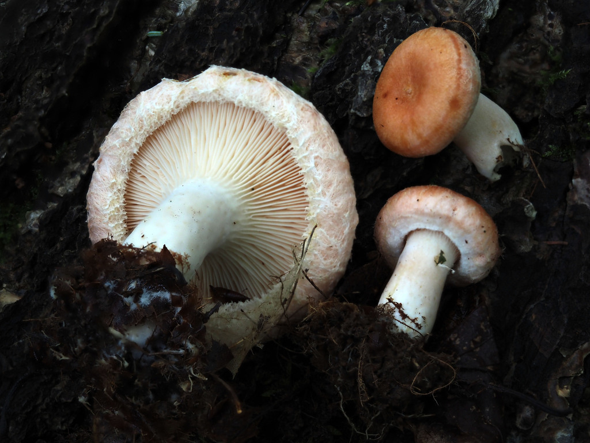
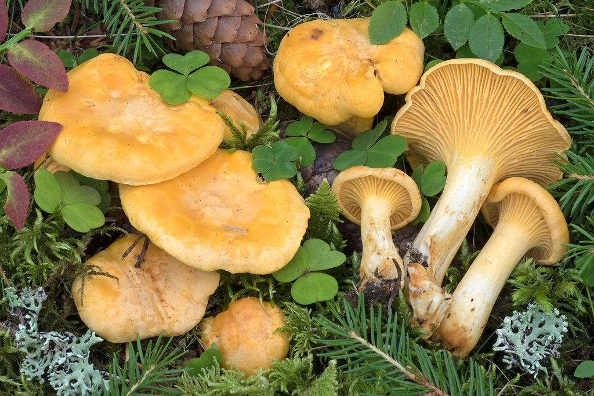
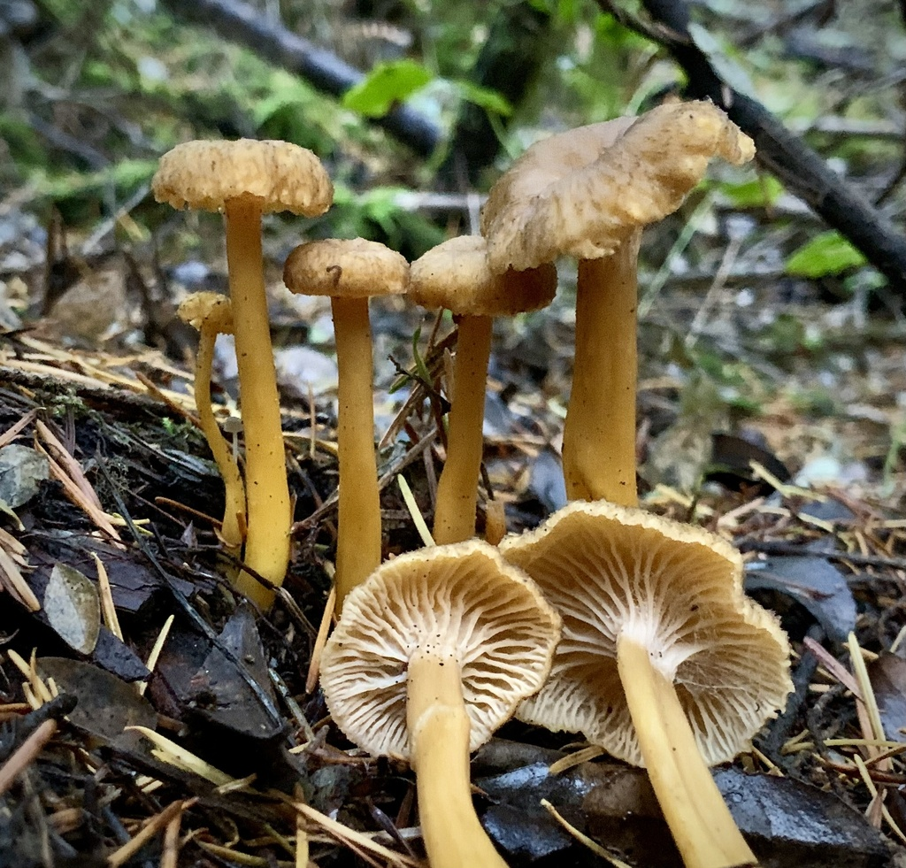

# 07. Preservation & Authentic Finnish Forest Recipes

Wild mushrooms harvested in Helsinki's forests are organic culinary treasures. Because a successful autumn excursion can yield several kilograms in a single afternoon, proper processing and storage are vital.

---

## 1. Preservation Methods

### A. Dehydration (*Kuivaus*)
Drying is the premier preservation method for thin-fleshed species and concentrates rich umami compounds.

- **Best Species for Drying**:
  - **Funnel Chanterelle** (*Craterellus tubaeformis* / *suppilovahvero*)
  - **Black Trumpet** (*Craterellus cornucopioides* / *mustatorvisieni*)
  - **King Bolete / Porcini** (*Boletus edulis* / *herkkutatti* - sliced into 4–5 mm planks)
  - **Wood Hedgehog** (*Hydnum repandum* - sliced thin)
- **Species to NEVER Dry**:
  - **Golden Chanterelles (*Cantharellus cibarius*)**: When dehydrated, golden chanterelles become rubbery, leathery, and develop an unpleasant, lingering bitterness that remains even after prolonged rehydration.
- **Dehydrator Settings**:
  - 40°C to 45°C for 6 to 12 hours until "cracker dry" (they must snap audibly when bent).
  - If using an electric oven: Set to 45°C with the convection fan running and prop the door open 2–3 cm with a wooden spoon to let humidity escape.
- **Storage**: Clean, airtight glass mason jars stored in a dark pantry. Dehydrated funnel chanterelles and black trumpets retain peak fragrance for **3 to 5 years**.
- **Rehydration**: Soak dried mushrooms in lukewarm water or broth for 20 minutes before cooking. **Never discard the soaking liquid**: filter it through a fine sieve and use it as a concentrated mushroom stock!

---

### B. Freezing in Natural Juices (*Pakastus omassa liemessä*)
Never freeze wild mushrooms raw! Raw freezing ruptures cellular walls, releasing enzymes that rapidly turn mushrooms mushy, watery, and bitter.

- **The Finnish Sauté Method (*Haudutus omassa liemessä*)**:
  1. Clean and chop mushrooms (essential for **Golden Chanterelles**, **Hedgehog mushrooms**, and **Boletes**).
  2. Heat a wide dry skillet over medium heat—**do not add butter or oil!** (Fats go rancid in the freezer over time).
  3. Add the chopped mushrooms. As the heat penetrates the fungal cells, the mushrooms will release a copious volume of flavorful natural juices.
  4. Simmer the mushrooms gently in their own liquid for 5–8 minutes until the liquid reduces by roughly half.
  5. Remove from heat and allow to cool completely to room temperature.
  6. Portion into ziplock freezer bags along with their concentrated broth, press out excess air, and freeze.
  7. **Shelf Life**: Up to 12 months at -18°C.

---

### C. Traditional Finnish Parboiling & Salting (*Ryöppäys ja suolaus*)
The traditional Nordic technique for preserving acrid milkcaps (*Lactarius torminosus*, *Lactarius trivialis*, *Lactarius rufus*) for the winter pantry.

1. **Parboiling (*Ryöppäys*)**:
   - Bring a large pot of water to a rolling boil (at least 3 liters of water per 1 kg of fresh milkcaps).
   - Plunge the cleaned mushrooms into boiling water. Boil for **10 to 15 minutes** (this extracts the bitter, burning diterpene resins into the water).
   - Drain in a colander and immediately flush with plenty of cold water to halt the cooking process and rinse away residual acridity.
   - Gently squeeze out excess water with your hands.
2. **Layering & Salting**:
   - In a sterilized glass jar or ceramic crock, layer the boiled mushrooms alternately with **coarse sea salt** (use roughly **100 g to 120 g of coarse non-iodized sea salt per 1 kg of boiled, squeezed mushrooms**).
   - Optional aromatics: Add whole allspice berries (*maustepippuri*), black peppercorns, and clean blackcurrant leaves between layers.
   - Press down firmly until brine covers the mushrooms. Weigh down with a clean saucer or food-grade weight.
   - Store in a cold refrigerator or cellar (2°C–5°C).
3. **Desalting Before Cooking (*Liotus*)**:
   - Before preparing a recipe, scoop out the salted mushrooms and soak them in a large bowl of cold water for 1 to 2 hours, changing the water once or twice, until the saltiness reaches a pleasant seasoning level.

---

## 2. Authentic Finnish Forest Recipes

---

### 1. Traditional Finnish Mushroom Salad (*Perinteinen sienisalaatti*)
*The crowned centerpiece of the Finnish Christmas table, also enjoyed year-round on dark sourdough rye bread.*

*(Made with desalted parboiled milkcaps such as Karvarousku or Haaparousku)*

- **Prep time**: 15 min (+ soaking time)
- **Yield**: 4–6 servings

#### Ingredients
- 300 g desalted, parboiled milkcaps (*suolatut rouskut*) OR rehydrated funnel chanterelles
- 1 small red onion or mild Finnish shallot, very finely diced
- 150 g Finnish *smetana* (sour cream with 42% fat) or thick *kermaviili* / crème fraîche
- 1/4 tsp finely ground white pepper
- 1 tsp freshly squeezed lemon juice or white wine vinegar
- A pinch of sea salt (only if needed after tasting)
- Fresh chives or dill for garnish

#### Instructions
1. Finely chop the desalted, squeezed mushrooms into tiny 3–4 mm cubes.
2. In a mixing bowl, whip the chilled *smetana* lightly with a fork until smooth and fluffy.
3. Fold in the finely diced red onion and chopped mushrooms.
4. Season with ground white pepper and lemon juice.
5. Cover and chill in the refrigerator for at least 1 hour before serving to allow the onion and mushroom flavors to meld.
6. Serve atop toasted slices of Finnish rye bread (*ruisleipä*) alongside cold-smoked salmon or boiled potatoes.

---

### 2. Classic Creamy Chanterelle Sauce (*Kermainen kantarellikastike*)
*The quintessential Finnish late-summer dish, traditionally paired with fresh dill-seasoned new potatoes (*uudet perunat*).*

- **Prep time**: 10 min
- **Cooking time**: 15 min
- **Yield**: 4 servings

#### Ingredients
- 500 g fresh golden chanterelles (*kantarelli*), brushed clean and coarsely chopped
- 1 medium yellow onion or 2 shallots, finely minced
- 2–3 tbsp real butter
- 200 ml Finnish heavy cream (*kuohukerma*) or full-fat cream
- 1/2 tsp sea salt
- 1/4 tsp freshly cracked black or white pepper
- 2 tbsp fresh parsley or dill, finely chopped

#### Instructions
1. Place the chopped chanterelles into a dry, wide frying pan over medium heat. Let them sweat and simmer in their own moisture until the liquid has evaporated.
2. Add the butter to the pan along with the minced onions.
3. Sauté over medium-low heat for 4–5 minutes until the onions are soft and translucent, and the chanterelles begin to turn lightly golden at the edges.
4. Pour in the heavy cream. Stir well, lower the heat, and simmer gently for 8–10 minutes until the cream thickens into a velvety, luscious sauce.
5. Season with salt and cracked pepper. Stir in the fresh parsley or dill right before taking off the heat.
6. Serve immediately poured over steaming, buttered new potatoes.

---

### 3. Autumn Funnel Chanterelle Soup with Smoked Cheese (*Suppilovahverokeitto*)
*A deeply comforting, rich soup designed for brisk October and November evenings after a day in Sipoonkorpi.*

- **Prep time**: 15 min
- **Cooking time**: 25 min
- **Yield**: 4 servings

#### Ingredients
- 1 liter fresh funnel chanterelles (*suppilovahvero*) OR 30 g dried funnel chanterelles (rehydrated)
- 2 tbsp butter
- 1 medium yellow onion, finely diced
- 1 garlic clove, finely minced
- 2 tbsp all-purpose flour (optional, for thickening)
- 600 ml rich vegetable or mushroom broth
- 200 ml heavy cream (*kuohukerma*) or oat cream
- 100 g Finnish *Koskenlaskija Savu* (smoked processed melting cheese) OR smoked gouda, cut into small cubes
- 1 tsp fresh thyme leaves
- Freshly cracked black pepper and sea salt to taste

#### Instructions
1. If using dried chanterelles, soak in warm water for 20 minutes and drain, reserving the soaking liquid to replace part of the broth. If using fresh, coarsely chop them.
2. In a heavy-bottomed soup pot, melt the butter over medium heat. Add the onion and garlic and sauté until fragrant and tender (about 3 minutes).
3. Add the mushrooms and thyme. Cook for 5 minutes until the mushrooms have softened and released their aroma.
4. Sprinkle the flour evenly over the mushrooms and stir continuously for 1 minute to cook out the raw flour taste.
5. Slowly whisk in the broth (and strained mushroom soaking water), stirring constantly to ensure no lumps form.
6. Bring to a gentle boil, then reduce heat and simmer for 10 minutes.
7. Lower the heat and add the cream and the cubes of smoked cheese (*Koskenlaskija*). Whisk gently over low heat until the cheese has completely melted into the velvety soup.
8. Season with fresh black pepper and salt to taste. Ladle into warm bowls and garnish with extra whole sautéed funnel chanterelles and thyme sprigs. Serve with crusty sourdough or dark archipelago bread (*saaristolaisleipä*).
