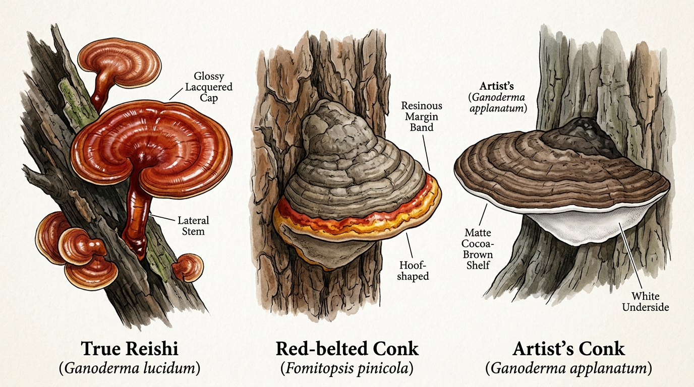
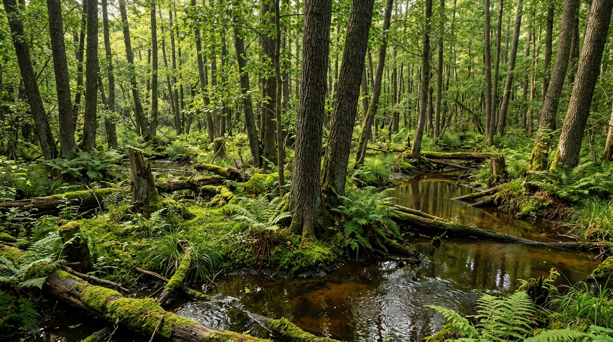
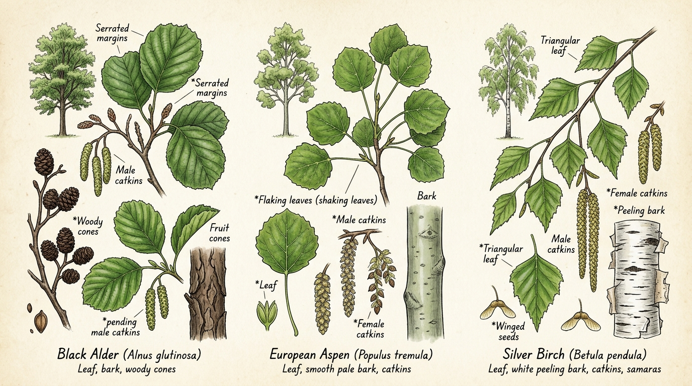

# 09. Wild Reishi in Helsinki: Occurrence, Wetland Habitats, Host Trees & Lookalike Defense
*Lakkakääpä Helsingin Seudulla • 赫尔辛基野生灵芝生态、宿主树种与拟假芝混淆防线*

Finding wild **Reishi** (*Ganoderma lucidum*, Finnish: ***lakkakääpä***, Chinese: 灵芝 / 赤芝) in the forests surrounding Helsinki is an extraordinary biological event. While common culinary mushrooms like Golden Chanterelles (*Cantharellus cibarius*) and Porcini (*Boletus edulis*) carpet hundreds of hectares across Uusimaa each autumn, *lakkakääpä* is an elusive, specialized polypore with very specific ecological requirements.

This handbook chapter provides a complete field guide to wild Reishi in Southern Finland: the realistic odds of finding it, the exact wetland microclimates and host trees to scan, a foolproof defense against ubiquitous lookalikes, and verified high-value video masterclasses.

---

## 1. Occurrence & Foraging Likelihood around Helsinki

### The Ecological Baseline: Can You Find It?
**Yes, but it is rare (< 5% probability on casual hikes).**

Finland spans multiple ecological vegetation zones, from the northern subarctic birch tundra to the southern coastal fringe. The **Helsinki Metropolitan Area and Uusimaa** lie directly within Finland’s narrow **hemiboreal zone**—the warmest, most biologically diverse forest zone in the country. 

In Finland's national biodiversity database ([Laji.fi](https://laji.fi)), *Ganoderma lucidum* (*lakkakääpä*) is classified as **Least Concern (LC / elinvoimainen)** nationally, but its wild fruiting bodies are restricted to ancient moist deciduous stands and wetland margins. It does not grow in standard commercial pine timber plantations or well-trodden dry spruce heaths.

```
[ Helsinki / Uusimaa Hemiboreal Zone ]  --> Core northern edge of natural Ganoderma lucidum
[ Target Fruiting Period ]              --> August to late October (annual conk; persists dried into winter)
[ Substrate Niche ]                     --> Decaying hardwood logs, stumps, root flares in standing wetlands
```

> [!NOTE]
> Unlike many bracket fungi (*käävät*) that are perennial and add a new pore layer every year, **true Reishi is an annual polypore**. It flushes fresh from mycelium in late summer, developing its brilliant lacquered mahogany shell over 4–8 weeks, before hardening into a woody, persistent bracket as freezing autumn temperatures arrive.

---

## 2. Visual Lookalike Defense: True Reishi vs. Common Impostors

In the forests of Nuuksio, Sipoonkorpi, and Keskuspuisto, **over 95% of reported "Reishi" sightings are actually two very common native polypores**: the **Red-belted conk** (*Fomitopsis pinicola*) and the **Artist's conk** (*Ganoderma applanatum*).



### Comprehensive Diagnostic Matrix

| Identification Trait | **True Reishi**<br>*(Ganoderma lucidum / Lakkakääpä)* | **Red-Belted Conk**<br>*(Fomitopsis pinicola / Kantokääpä)* | **Artist's Conk**<br>*(Ganoderma applanatum / Lattakääpä)* |
| :--- | :--- | :--- | :--- |
| **Cap Surface** | **High-gloss lacquer**, glossy deep red-orange, chestnut-mahogany to amber-yellow edge. | Dull grey-black core with a **resinous yellow-orange-red band** along the active margin. | **Matte, dull cocoa-brown to greyish**, heavily dusted with powdery brown spores; no lacquer. |
| **Stem (Stipe)** | **Distinct lateral or eccentric stalk** (woody, twisted, shiny dark reddish-black). | **No stem** (sessile); attaches broadly and directly to the wood. | **No stem** (sessile); wide, flat bracket emerging horizontally from trunk. |
| **Shape** | Kidney-shaped, fan-like, or circular, often with undulating wavy margins. | **Thick, hoof-shaped or triangular shelf**, rigid and woody. | **Extremely flat, wide bracket**, shelf-like with thin leading edge. |
| **Pore Surface (Underside)** | Creamy-white to buff; bruises pale brownish when handled fresh. | Cream-white to yellowish; often exudes clear **guttation droplets** when growing. | **Pure white when fresh; immediately bruises dark sepia-brown** when scratched. |
| **Host Wood** | **Deciduous hardwoods** (Black Alder, Aspen, Birch, rarely Oak). | **Conifers** (Spruce, Pine), occasionally Birch. | **Deciduous hardwoods** (Birch, Aspen, Lime/Linden, Alder). |
| **Frequency in Helsinki** | **Rare / Localized** in wetlands. | **Ubiquitous (found in every forest)**. | **Very Common** in parks, old woods, and deadwood. |

> [!IMPORTANT]
> **The Two Ironclad Rules of Reishi Identification in Finland**:
> 1. **Look for the stem**: True wild *Ganoderma lucidum* in Fennoscandia almost always develops a distinct lateral or eccentric stipe (stalk). If the bracket is a stemless, hoof-shaped block fused directly into a pine or spruce stump, it is *Fomitopsis pinicola*.
> 2. **Look for the genuine lacquer**: The red band on *Fomitopsis pinicola* can look glossy when wet from rain, but *Ganoderma lucidum* possesses a true microscopic crust of varnished intercellular lacquer over its entire top surface that shines even in dry conditions.

---

## 3. Prime Wetland Habitats around Helsinki

To find wild *lakkakääpä*, you must leave dry footpaths and seek out permanently humid, standing wetland microclimates.



### The Primary Ecosystem: *Tervaleppäkorpi* (Coastal Black Alder Swamps)
- **Ecological Dynamics**: *Tervaleppäkorpi* is a protected mire habitat type dominated by Black Alder (*Alnus glutinosa*). The root systems form elevated buttressed mounds (*mättäät*) surrounded by slow-moving or stagnant tea-colored water rich in humic acids.
- **Microclimate**: Constant 85–95% ambient humidity, shaded canopy, high volume of semi-submerged deadwood and moss-blanketed fallen trunks.
- **Prime Locations in Uusimaa**:
  - **Vanhankaupunginlahti Nature Reserve** (Viikki / Pornaistenniemi / Lammassaari boardwalk margins): The largest coastal wetland forest in Helsinki, densely populated with mature black alder carrs.
  - **Byabäcken Valley (Sipoonkorpi)**: The lush, nutrient-rich river basin in northern Sipoonkorpi features flooded alder margins and old rotting deciduous logs.
  - **Laajalahti Coastal Wetlands (Espoo/Helsinki border)**: Swampy deciduous stands bordering reedbeds.
  - **Meiko Nature Reserve (Kirkkonummi)**: Undisturbed wilderness lake shores with flooded shoreline trees.

---

## 4. Host & Partner Tree Field Diagnostics

*Ganoderma lucidum* is a white-rot wood-decay fungus that feeds on lignin in dead or dying hardwoods. Around Helsinki, it associates with three main tree species:



### 1. Black Alder (*Alnus glutinosa* / *Tervaleppä*) — The #1 Host
- **The Tree**: Finland's native water-loving deciduous giant, forming extensive shoreline groves.
- **Bark**: Dark charcoal-grey to blackish-brown, deeply fissured and rough.
- **Leaves**: Distinctive round or obovate leaves with a **notched or indented apex** (the leaf tip indents inwards rather than coming to a sharp point). Glossy deep green with serrated margins.
- **Cones**: Small, persistent woody cones (*leppäkävyt*) that linger on branches throughout autumn and winter.
- **Where Reishi Grows**: At the submerged base, exposed root flares, or mossy fallen trunks of old, dying alders.

### 2. European Aspen (*Populus tremula* / *Haapa*)
- **The Tree**: Key ecological keystone species in Finnish boreal forests, supporting hundreds of specialized fungal and insect species.
- **Bark**: Smooth, pale greenish-grey on young to middle-aged trunks; deeply furrowed and diamond-cracked at the base of mature trees.
- **Leaves**: Broadly circular with blunt, wavy teeth. Long, laterally flattened petioles cause the leaves to flutter and rustle in the slightest breeze (*vavisevat haavanlehdet*).
- **Where Reishi Grows**: Giant fallen rotting aspen logs in shaded valleys and damp ravines.

### 3. Silver Birch & Downy Birch (*Betula pendula* / *Betula pubescens*)
- **The Tree**: Widespread across all Finnish forest types. Downy birch (*hieskoivu*) tolerates waterlogged mire soils, while silver birch (*rauduskoivu*) prefers well-drained heaths.
- **Bark**: Bright chalky-white papery bark that peels in horizontal strips, developing dark rough rectangular plates at the base.
- **Leaves**: Triangular to diamond-shaped with doubly serrated margins.
- **Where Reishi Grows**: Moss-covered birch stumps and decomposing nurse logs in wet depressions.

---

## 5. High-Value Verified Video Masterclasses

To build true field confidence in identifying *Ganoderma* species and extracting their therapeutic constituents, study these four verified, authoritative video masterclasses:

### 1. Field Identification & Medicinal Chemistry — Learn Your Land
- **Instructor**: Adam Haritan (Renowned Botanist & Forager, *Learn Your Land*)
- **Core Topics**: Microscopic and macroscopic markers of *Ganoderma*, identifying varnished shelf fungi in the wild, testing pore bruise reactions, and understanding bioactive triterpenes.
- **Direct Video Link**: [Watch: Reishi Mushroom Identification & Medicinal Benefits on YouTube](https://www.youtube.com/watch?v=Gv0rgT0NODM)

### 2. Sustainable Wild Harvesting Ethics — Learn Your Land
- **Instructor**: Adam Haritan (*Learn Your Land*)
- **Core Topics**: Ethical field foraging, assessing the maturity stage of lacquered conks, harvesting without destroying mycelial wood networks, and field drying techniques.
- **Direct Video Link**: [Watch: Harvesting Wild Reishi Mushrooms on YouTube](https://www.youtube.com/watch?v=IdGd9ifEQgY)

### 3. Deep Dive into *Ganoderma lucidum* Growth & Anatomy — FreshCap Mushrooms
- **Channel**: FreshCap Mushrooms
- **Core Topics**: The unique anatomical morphology of *Ganoderma lucidum*, how antler vs conk shapes form under different CO2 levels, lacquer development, and pore structure under magnification.
- **Direct Video Link**: [Watch: Unlocking The Secrets of Reishi (Ganoderma lucidum) on YouTube](https://www.youtube.com/watch?v=9MLJgGvxMvs)

### 4. Dual-Extraction Tincture & Decoction Protocol — Spore n' Sprout
- **Channel**: Spore n' Sprout
- **Core Topics**: Step-by-step laboratory and kitchen extraction protocol: boiling water decoction for water-soluble polysaccharides (beta-glucans) combined with high-proof alcohol maceration for alcohol-soluble triterpenoids (ganoderic acids).
- **Direct Video Link**: [Watch: How to Make Reishi Dual Extract Tincture on YouTube](https://www.youtube.com/watch?v=0ysYXxi9Uzw)

---

## 6. Extraction Science & Finnish Biotechnology

Reishi is biologically **inedible in culinary dishes** because its flesh is hard, corky, and fibrous like wood. To benefit from its compounds, it must be extracted.

### The Dual-Extraction Science
True Reishi contains two primary classes of medicinal compounds with opposing solubility profiles:
1. **Beta-D-Glucans (Polysaccharides)**: Water-soluble immune-modulating compounds. Extracted via prolonged hot water decoction (simmering at 85–95°C for 2–4 hours).
2. **Ganoderic Acids (Triterpenoids)**: Alcohol-soluble bitter compounds responsible for adaptogenic, anti-inflammatory, and liver-supportive properties. Extracted via maceration in 60–80% ethanol for 4–6 weeks.

```
Dried Wild Reishi (Sliced thin)
  ├── 1. Alcohol Maceration (60–80% organic spirit, 4–6 weeks) ──> Triterpenes & Bitter Sterols
  └── 2. Water Decoction (Simmer leftover marc in water 2–4 hrs) ──> Polysaccharides & Beta-Glucans
         └── Combined into a balanced 25–30% ABV shelf-stable Dual-Extract Tincture
```

### Finnish Scientific Research & Cultivation
- **Natural Resources Institute Finland (Luke)**: Groundbreaking research led by Dr. Marta Cortina-Escribano (*Selective breeding and taxonomy of laccate Ganoderma species originating from Finland*, Luke / University of Helsinki) analyzed wild Finnish *Ganoderma* isolates. The research established that native Finnish strains are genetically adapted to cold climates and thrive on Finnish forestry side-streams (birch and aspen woodchips).
- **Commercial Finnish Reishi (KÄÄPÄ Biotech)**: In Karjalohja (Lohja, Uusimaa), Finnish biotechnology leaders cultivate organic Reishi on certified birch substrates, utilizing native strains derived from Finnish forests rather than harvesting endangered wild populations.

---

## 7. Legal & Conservation Guidelines (Everyman's Right)

When foraging in Finland, you must strictly observe the boundaries of **Everyman's Right** (*Jokamiehenoikeus*):

> [!CAUTION]
> **Harvesting from Living Trees is Strictly Prohibited**:
> Under Finnish law, Everyman's Right grants permission to pick wild mushrooms growing in soil or on fallen, dead wood (*maapuu*). **Removing bracket fungi or polypores from living, standing trees damages the cambium and requires explicit landowner permission (*maanomistajan lupa*)**. 

1. **Protected Areas**: In strict nature reserves (*luonnonsuojelualueet*) such as core zones of Vanhankaupunginlahti, local bylaws forbid the removal of wood-decay fungi, which serve as essential habitat for rare saproxylic beetles.
2. **Citizen Science Best Practice**: Because wild *lakkakääpä* is a rare ecological indicator in Finland, mycologists strongly recommend **leaving the fruiting body intact on the log**, taking sharp macro photographs (cap, pore underside, stem, host wood), and recording your sighting on **[Laji.fi](https://laji.fi)** to support Finnish biodiversity monitoring.
3. **Explore the Species in the Interactive Guide**: View the full diagnostic profile and interactive photo gallery directly in the [Interactive Field Companion](../index.html#/mushroom/ganoderma_lucidum).
